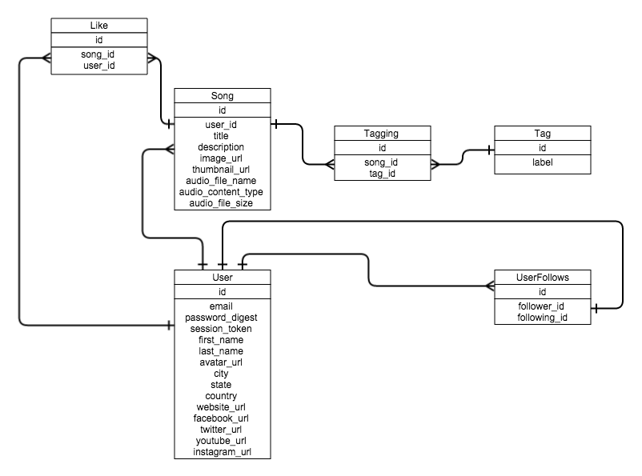

# Schema Information

## user
column name     | data type | details
----------------|-----------|-----------------------
id              | integer   | not null, primary key
email           | string    | not null, unique
password_digest | string    | not null
session_token   | string    | not null, unique
gravatar_url    | string    | not null, unique

## profile

column name     | data type | details
----------------|-----------|-----------------------
id              | integer   | not null, primary key
first_name      | string    | not null
last_name       | string    | not null
gravatar_url    | string    |
city            | string    |
state           | string    |
country         | string    |

## song
column name | data type | details
------------|-----------|-----------------------
id          | integer   | not null, primary key
artist_id   | integer   | not null, foreign key (references user)
title       | string    | not null
description | string    |

## tag
column name | data type | details
------------|-----------|-----------------------
id          | integer   | not null, primary key
label       | string    | not null, unique

## tagging
column name | data type | details
------------|-----------|-----------------------
id          | integer   | not null, primary key
song_id     | integer   | not null, foreign key (references song)
tag_id      | integer   | not null, foreign key (references tag)

## like
column name | data type | details
------------|-----------|-----------------------
id          | integer   | not null, primary key
song_id     | integer   | not null, foreign key (references song)
user_id   | integer   | not null, foreign key (references user)

## following
column name | data type | details
------------|-----------|-----------------------
id          | integer   | not null, primary key
artist_id   | integer   | not null, foreign key (references user)
follower_id | integer   | not null, foreign key (references user)
